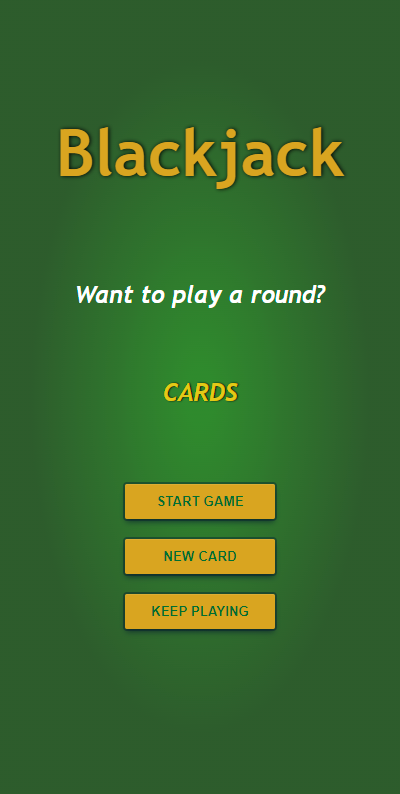

# Score Board

### Table of Contents

- [Description](#Description)
- [Project Status](#Project-Status)
- [Technologies Used](#Technologies-Used)
- [Visuals](#Visuals)
  - [Web](#Web)
  - [Mobile](#Mobile)
- [Issues and future changes](#Future-changes)
- [Referenced Materials](#Referenced-Materials)
  - [Blackjack](#Scrimba)
- [License](#MIT-License)

## Description

A simple blackjack game. The purpose of this project was to practice; Arrays, objects, booleans, if else statements, comparison operators, for loops, the Math object, and return statements. As well as to test my skills and add additional functions to the game, one being to add and remove player chips if a player has won or lost the game.

[Table of Contents](#Table-of-Contents)

## Project-Status

Complete.

[Table of Contents](#Table-of-Contents)

## Technologies-Used

     - CSS
     - HTML
     - JavaScript

[Table of Contents](#Table-of-Contents)

## Visuals

### Web

### Mobile

[Table of Contents](#Table-of-Contents)

## Future-changes

No current plans for future changes.

[Table of Contents](#Table-of-Contents)

## Referenced-Materials

### Scrimba

[Score Board](https://scrimba.com/playlist/p3py7U7)

[Table of Contents](#Table-of-Contents)

## MIT License

Copyright (c) 2022 Emily Smith

Permission is hereby granted, free of charge, to any person obtaining a copy of this software and associated documentation files (the "Software"), to deal in the Software without restriction, including without limitation the rights to use, copy, modify, merge, publish, distribute, sublicense, and/or sell copies of the Software, and to permit persons to whom the Software is furnished to do so, subject to the following conditions:

The above copyright notice and this permission notice shall be included in all copies or substantial portions of the Software.

THE SOFTWARE IS PROVIDED "AS IS", WITHOUT WARRANTY OF ANY KIND, EXPRESS OR IMPLIED, INCLUDING BUT NOT LIMITED TO THE WARRANTIES OF MERCHANTABILITY, FITNESS FOR A PARTICULAR PURPOSE AND NONINFRINGEMENT. IN NO EVENT SHALL THE AUTHORS OR COPYRIGHT HOLDERS BE LIABLE FOR ANY CLAIM, DAMAGES OR OTHER LIABILITY, WHETHER IN AN ACTION OF CONTRACT, TORT OR OTHERWISE, ARISING FROM, OUT OF OR IN CONNECTION WITH THE SOFTWARE OR THE USE OR OTHER DEALINGS IN THE SOFTWARE.

[Table of Contents](#Table-of-Contents)
